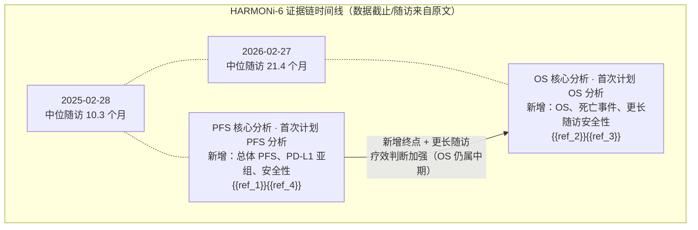

# HARMONi-6 完整临床结果解读

**一句话结论：** 在既往未治疗的晚期鳞状非小细胞肺癌中，HARMONi-6 报告 ivonescimab 联合化疗相较 tislelizumab 联合化疗改善主要终点 PFS，并在首次计划 OS 分析中达到预设统计边界；较长随访使试验级疗效证据从 PFS 延伸至 OS，但 OS 仍是中期分析，长期安全性、缓解持续性、症状和生活质量证据尚不完整。{{ref_1}}{{ref_2}}{{ref_3}}{{ref_4}}

> **证据范围：** 本报告仅整合所选 4 份来源（2 份期刊摘要、2 份会议摘要），均指向同一试验 HARMONi-6（NCT05840016）。相同数据截止和分析的重复披露合并为同一证据状态，不计作独立验证。正文中的数字和关键事实均可追溯到具体来源，并由前端展示为行内上角标引用。

## 一、试验要回答的临床问题

- **目标人群：** 既往未治疗、病理确诊、不可切除 IIIB、IIIC 或 IV 期鳞状非小细胞肺癌患者；入组年龄为 18-75 岁，ECOG 体能状态为 0 或 1。{{ref_1}}{{ref_3}}
- **核心治疗问题：** 在一线晚期鳞状非小细胞肺癌中，ivonescimab 联合 paclitaxel 和 carboplatin、随后 ivonescimab 维持，是否优于 tislelizumab 联合相同化疗及 tislelizumab 维持。{{ref_1}}{{ref_3}}
- **主要终点与检验框架：** 主要终点为独立影像学审查委员会按 RECIST 1.1 评估的 PFS；OS 为关键次要终点，在 PFS 达到统计学显著后按闭合序贯检验程序进行检验。{{ref_1}}{{ref_2}}{{ref_3}}{{ref_4}}
- **当前证据覆盖：** 所选材料覆盖总体 PFS、首次计划 OS 分析、PD-L1 TPS 亚组、部分基线特征，以及较早和较晚分析状态下的安全性；材料未完整报告应答深度、缓解持续时间、症状、生活质量和最终 OS。{{ref_1}}{{ref_2}}{{ref_3}}{{ref_4}}

## 二、研究设计与治疗方案

| 维度 | 综合信息 | 引用标记 |
|---|---|---|
| 研究名称/注册号 | HARMONi-6；NCT05840016。{{ref_1}}{{ref_2}}{{ref_3}}{{ref_4}} | {{ref_1}}{{ref_2}}{{ref_3}}{{ref_4}} |
| 阶段与设计 | 随机、双盲、III 期研究，在中国 50 个中心/医院开展。{{ref_1}}{{ref_3}}{{ref_4}} | {{ref_1}}{{ref_3}}{{ref_4}} |
| 入组人群 | 既往未治疗、病理确诊、不可切除 IIIB、IIIC 或 IV 期鳞状非小细胞肺癌；ECOG 体能状态为 0 或 1。{{ref_1}}{{ref_3}} | {{ref_1}}{{ref_3}} |
| 随机与样本 | 532 例患者按 1:1 随机分配；ivonescimab 组 266 例，tislelizumab 组 266 例。{{ref_1}}{{ref_2}}{{ref_3}}{{ref_4}} | {{ref_1}}{{ref_2}}{{ref_3}}{{ref_4}} |
| 试验组 | ivonescimab 20 mg/kg，每 3 周一次，联合 paclitaxel 175 mg/m² 和 carboplatin AUC 5，共 4 个周期；随后 ivonescimab 单药维持，最长 24 个月。{{ref_1}}{{ref_2}}{{ref_3}}{{ref_4}} | {{ref_1}}{{ref_2}}{{ref_3}}{{ref_4}} |
| 对照组 | tislelizumab 200 mg，每 3 周一次，联合 paclitaxel 175 mg/m² 和 carboplatin AUC 5，共 4 个周期；随后 tislelizumab 单药维持，最长 24 个月。{{ref_1}}{{ref_2}}{{ref_3}}{{ref_4}} | {{ref_1}}{{ref_2}}{{ref_3}}{{ref_4}} |
| 分层因素 | 疾病分期（IIIB/IIIC 对 IV）和 PD-L1 肿瘤比例评分 TPS（≥1% 对 <1%）。{{ref_1}}{{ref_2}}{{ref_3}}{{ref_4}} | {{ref_1}}{{ref_2}}{{ref_3}}{{ref_4}} |
| 主要终点 | 独立影像学审查委员会按 RECIST 1.1 评估的 PFS，分析全部随机患者。{{ref_1}}{{ref_3}}{{ref_4}} | {{ref_1}}{{ref_3}}{{ref_4}} |
| 关键次要终点 | OS；采用闭合序贯检验，PFS 达到显著后才检验 OS。{{ref_2}}{{ref_3}} | {{ref_2}}{{ref_3}} |
| 安全性分析集 | 随机后至少接受一次分配治疗的患者；安全性包括治疗相关不良事件、严重不良事件，以及免疫或 VEGF 阻断相关不良事件。{{ref_1}}{{ref_3}} | {{ref_1}}{{ref_3}} |

患者筛选和随机发生于 2023-08-17 至 2025-01-21 期间；761 例接受资格评估，532 例最终随机。{{ref_1}}{{ref_3}} OS 分析来源还报告随机患者中 494 例（93%）为男性、38 例（7%）为女性，中位年龄 64 岁（IQR 59-69）。{{ref_3}} PFS 会议摘要补充报告基线中央型肿瘤占 63.2%、肿瘤空洞占 8.8%、大血管包绕占 17.5%，并称两组基线特征总体平衡。{{ref_4}}

## 三、证据链总览与时间线

**时间轴图：** 两个证据状态（PFS 核心分析 → OS 核心分析）按原文支持的时序排列；来源 1 与 4 共享总体 PFS 合并为同一状态，来源 2 与 3 共享 2026-02-27 截止的 OS 合并为同一状态，因此图中只有两个节点，不把重复披露当作独立验证。

四个来源可合并为两个核心疗效证据状态，而不是四个独立结果：较早的 PFS 状态和较晚的 OS 状态。{{ref_1}}{{ref_2}}{{ref_3}}{{ref_4}}

| 证据状态 | 数据截止/随访/分析里程碑 | 本阶段新增的证据 | 相对前一状态的影响 | 支持来源 |
|---|---|---|---|---|
| PFS 核心分析 | 来源 {{ref_1}} 报告截至 2025-02-28；中位随访 10.3 个月（95% CI 9.5-11.0）。{{ref_1}} 来源 {{ref_4}} 称其为首次计划 PFS 分析，并报告单侧 P=0.0094 的效能边界，但未提供独立的数据截止或随访。{{ref_4}} | 建立总体主要终点 PFS；补充 PD-L1 TPS 亚组、基线解剖特征及部分安全性信息。{{ref_1}}{{ref_4}} | 建立随机对照的 PFS 疗效判断；总体 PFS 在两份来源中重复，不构成独立验证。{{ref_1}}{{ref_4}} | {{ref_1}}{{ref_4}} |
| OS 核心分析 | 截至 2026-02-27；中位随访 21.4 个月（95% CI 20.27-21.91）；首次计划 OS 分析。{{ref_2}}{{ref_3}} 该分析在 204 个死亡事件时触发，原计划约 225 个事件。{{ref_3}} | 新增关键次要终点 OS、预设统计边界、死亡事件数、PD-L1 TPS 亚组和较长随访安全性。{{ref_2}}{{ref_3}} | 证据从 PFS 延伸至 OS，试验级疗效判断得到加强；但该分析仍有中期成熟度边界。{{ref_2}}{{ref_3}} | {{ref_2}}{{ref_3}} |

来源 {{ref_1}} 与 {{ref_4}} 共享总体 PFS 的中位数、HR 和显著性结果，因此合并为同一 PFS 状态；{{ref_4}} 的增量主要是 PD-L1 PFS 亚组、基线解剖特征和不同安全性指标。{{ref_1}}{{ref_4}} 来源 {{ref_2}} 与 {{ref_3}} 共享 2026-02-27 数据截止、21.4 个月中位随访和总体 OS 估计，因此合并为同一 OS 状态；两者的差异在于层级检验、亚组、事件触发背景和安全性细节。{{ref_2}}{{ref_3}} 四个来源均保留为引用入口，但不应被解读为四次独立的患者级验证。{{ref_1}}{{ref_2}}{{ref_3}}{{ref_4}}

## 四、疗效证据链

### 4.1 主要终点：PFS

| 分析状态 | 人群/分析集 | 试验组结果 | 对照组结果 | 研究内比较效应 | 截止/随访与成熟度 | 引用标记 |
|---|---|---|---|---|---|---|
| 首次计划/主要 PFS 分析 | 532 例随机患者。{{ref_1}}{{ref_3}} | 中位 PFS 11.1 个月（95% CI 9.9-NE）。{{ref_1}}{{ref_4}} | 中位 PFS 6.9 个月（95% CI 5.8-8.6）。{{ref_1}}{{ref_4}} | HR 0.60（95% CI 0.46-0.78），单侧 p<0.0001。{{ref_1}}{{ref_4}} | 截至 2025-02-28；中位随访 10.3 个月（95% CI 9.5-11.0）。{{ref_1}} 来源 {{ref_4}} 另称为首次计划分析，效能边界为单侧 P=0.0094。{{ref_4}} | {{ref_1}}{{ref_4}} |

**解读：** PFS 是经独立影像学审查委员会按 RECIST 1.1 评估的主要终点；在该随机比较中，原文报告 ivonescimab 联合化疗相较 tislelizumab 联合化疗显著改善 PFS。{{ref_1}}{{ref_4}} 来源 {{ref_4}} 报告 PD-L1 TPS <1% 亚组的中位 PFS 为 9.9 对 5.7 个月，HR 0.55（95% CI 0.37-0.82）；TPS ≥1% 亚组的中位 PFS 为 12.6 对 8.6 个月，HR 0.66（95% CI 0.46-0.95）。{{ref_4}} 两个所报告亚组均呈有利方向，但材料未报告交互检验，不能仅依据点估计判断哪一 PD-L1 层级的相对获益更大。{{ref_4}}

### 4.2 关键次要终点与生存：OS

| 终点 | 分析状态 | 人群/分析集 | 试验组结果 | 对照组结果 | 研究内比较效应 | 统计状态与成熟度 | 引用标记 |
|---|---|---|---|---|---|---|---|
| OS | 首次计划 OS 分析/预设中期分析 | 532 例随机患者；具体 OS 分析集未进一步报告。{{ref_2}}{{ref_3}} | 中位 OS 27.9 个月（95% CI 27.89-NE）。{{ref_2}}{{ref_3}} | 中位 OS 23.7 个月（95% CI 20.11-NE）。{{ref_2}}{{ref_3}} | 死亡 HR 0.66（95% CI 0.50-0.87），单侧 p=0.0017。{{ref_2}}{{ref_3}} | 达到预设单侧 p<0.0049 边界；属于首次计划/中期 OS 分析，尚非最终 OS。{{ref_2}}{{ref_3}} | {{ref_2}}{{ref_3}} |

**解读：** OS 是在 PFS 先达到统计学显著后进行的关键次要终点检验；OS 的 HR 和 p 值达到预设边界，使同一试验的疗效证据由疾病进展层面扩展到生存层面。{{ref_2}}{{ref_3}} OS 分析在 204 个死亡事件时因监管时限触发，而原计划约 225 个事件；两组中位 OS 置信区间上限均为 NE，因此不能将其表述为最终成熟 OS。{{ref_3}}

PD-L1 TPS <1% 亚组中，ivonescimab 组中位 OS 为 NE，对照组为 18.6 个月，HR 0.64（95% CI 0.43-0.96）；TPS ≥1% 亚组中，ivonescimab 组中位 OS 为 NE，对照组为 27.3 个月，HR 0.68（95% CI 0.46-0.99）。{{ref_2}} 两个亚组均报告有利方向，但所选材料未提供交互检验，不能据此判断 PD-L1 层级之间的相对获益差异。{{ref_2}}

### 4.3 应答、深度、持续性、症状与生活质量

所选材料未报告客观缓解率、完全缓解率、缓解持续时间、固定时间点生存率、症状或生活质量结果。{{ref_1}}{{ref_2}}{{ref_3}}{{ref_4}} 因此，当前试验级判断可以覆盖 PFS 和 OS，但不能完整评价应答深度、缓解持久性或患者感受获益。{{ref_1}}{{ref_2}}{{ref_3}}{{ref_4}}

### 4.4 亚组、敏感性与一致性

除 PD-L1 TPS <1% 和 ≥1% 亚组外，所选材料称 PFS 或 OS 获益在关键预设亚组中保持一致，但没有完整列出所有亚组估计，也未报告交互检验。{{ref_1}}{{ref_2}}{{ref_3}}{{ref_4}} 这支持“所报告关键亚组未见方向反转”的有限表述，不足以证明各亚组效应完全相同或存在统计学同质性。{{ref_1}}{{ref_2}}{{ref_3}}{{ref_4}}

## 五、安全性证据链

| 分析状态/截止 | 安全性人群与暴露 | 事件定义 | 试验组 | 对照组 | 随时间的变化或限制 | 引用标记 |
|---|---|---|---|---|---|---|
| PFS 核心分析，截至 2025-02-28 | 随机后至少接受一次分配治疗者；具体安全性暴露时长未报告。{{ref_1}} | ≥3 级治疗相关不良事件 | 170（64%）。{{ref_1}} | 144（54%）。{{ref_1}} | 较早切点；未报告完整暴露时长、停药、减量、中断和治疗相关死亡。{{ref_1}} | {{ref_1}} |
| PFS 核心分析，截至 2025-02-28 | 同一安全性分析集；暴露时长未报告。{{ref_1}} | ≥3 级免疫相关不良事件 | 24（9%）。{{ref_1}} | 27（10%）。{{ref_1}} | 不能据此推断长期事件风险。{{ref_1}} | {{ref_1}} |
| PFS 核心分析，截至 2025-02-28 | 同一安全性分析集；暴露时长未报告。{{ref_1}} | ≥3 级治疗相关出血 | 5（2%）。{{ref_1}} | 2（1%）。{{ref_1}} | 不能与其他来源不同切点下的出血数值直接合并为时间趋势。{{ref_1}} | {{ref_1}} |
| PFS 补充分析，截止未报告 | 安全性分母和暴露信息未完整报告。{{ref_4}} | 治疗相关严重不良事件；≥3 级出血 | 治疗相关严重不良事件 32.3%；≥3 级出血 1.9%。{{ref_4}} | 治疗相关严重不良事件 30.2%；≥3 级出血 0.8%。{{ref_4}} | 事件定义或报告范围与来源 {{ref_1}} 不完全相同，不能视为同一指标的独立更新。{{ref_1}}{{ref_4}} | {{ref_1}}{{ref_4}} |
| OS 核心分析，截至 2026-02-27 | 安全性分母为 ivonescimab 组 266 例、tislelizumab 组 265 例；暴露时长未完整报告。{{ref_3}} | ≥3 级治疗相关不良事件 | 184/266（69%）。{{ref_3}} | 156/265（59%）。{{ref_3}} | 较长随访；分母与随机样本存在差异，不能只按比例推断累积风险趋势。{{ref_3}} | {{ref_3}} |
| OS 核心分析，截至 2026-02-27 | 同一 OS 状态；安全性分母如上。{{ref_3}} | ≥3 级出血 | 7/266（3%）。{{ref_3}} | 2/265（1%）。{{ref_3}} | 与来源 {{ref_1}} 的出血数字来自不同分析状态；未提供完整暴露调整信息。{{ref_1}}{{ref_3}} | {{ref_1}}{{ref_3}} |
| OS 补充分析，截至 2026-02-27 | 安全性结果定性更新；完整事件谱未报告。{{ref_2}} | “无新的安全性信号” | 原文未提供完整事件谱。{{ref_2}} | 原文未提供完整事件谱。{{ref_2}} | 这是来源定性判断，不等于无风险或长期安全性已充分确定。{{ref_2}} | {{ref_2}} |

**获益-风险解读：** 所选材料提供了两个分析切点的治疗相关不良事件和出血结果，但安全性定义、分母、暴露和随访并未完全统一；因此不能把较早状态的 64% 对 54% 与较晚状态的 69% 对 59% 简单解释为风险随时间上升，也不能仅凭比例判定总体安全性优劣。{{ref_1}}{{ref_3}}{{ref_4}} 来源 {{ref_2}} 称未出现新的安全性信号，这一表述应保留为来源判断，不能替代完整的停药、减量、中断、治疗相关死亡和暴露数据。{{ref_2}}{{ref_3}}

## 六、证据成熟度、矛盾与信息缺口

### 6.1 已经较为确定

- HARMONi-6 是一个 532 例、1:1 随机、双盲、III 期研究，PFS 经独立影像学审查委员会按 RECIST 1.1 评估。{{ref_1}}{{ref_2}}{{ref_3}}{{ref_4}}
- 在所报告的总体分析中，ivonescimab 联合化疗相较 tislelizumab 联合化疗的 PFS HR 为 0.60，OS HR 为 0.66，且分别报告达到对应预设统计边界。{{ref_1}}{{ref_2}}{{ref_3}}{{ref_4}}
- 两个 PFS 来源和两个 OS 来源分别形成重复或互补来源组，而非四个独立疗效验证。{{ref_1}}{{ref_2}}{{ref_3}}{{ref_4}}

### 6.2 仍属中期或有限

- OS 首次计划分析在 204 个死亡事件时触发，早于原计划约 225 个事件；两组中位 OS 置信区间上限仍为 NE。{{ref_3}}
- PD-L1 亚组报告了有利方向，但没有交互检验；不能依据亚组点估计比较不同 PD-L1 层级的相对获益大小。{{ref_2}}{{ref_4}}
- 安全性缺少完整暴露时间、停药、剂量调整、中断和治疗相关死亡信息。{{ref_1}}{{ref_2}}{{ref_3}}{{ref_4}}

### 6.3 来源间需要解释的差异

- 来源 {{ref_1}} 明确报告 2025-02-28 数据截止和 10.3 个月随访，{{ref_4}} 称首次计划 PFS 分析但没有给出截止或随访；两者共享总体 PFS 数值，因此 {{ref_4}} 作为同一 PFS 状态的亚组和安全性补充，而非独立时间节点。{{ref_1}}{{ref_4}}
- 两份 OS 来源共享 2026-02-27 数据截止、21.4 个月随访、中位 OS 27.9 对 23.7 个月和 HR 0.66；差异是层级检验、亚组、事件触发背景和安全性细节，不构成两个 OS 分析。{{ref_2}}{{ref_3}}
- 来源 {{ref_1}} 报告 ≥3 级治疗相关出血为 5（2%）对 2（1%），{{ref_3}} 在 OS 状态报告为 7/266（3%）对 2/265（1%）；这两个数值对应不同分析状态，不能把差异解释为单纯的时间趋势。{{ref_1}}{{ref_3}}

### 6.4 尚未报告但会影响判断的信息

最终 OS、更成熟事件数下的置信区间、更新 PFS、客观缓解率、完全缓解率、缓解持续时间、症状/生活质量、完整亚组交互分析、暴露调整安全性、停药/减量/中断和治疗相关死亡仍未由所选材料完整提供。{{ref_1}}{{ref_2}}{{ref_3}}{{ref_4}}

## 七、整个试验的综合解读

### 7.1 疗效结论

HARMONi-6 的核心证据链是连贯的：在同一随机、双盲、III 期研究中，较早的主要终点 PFS 报告 ivonescimab 联合化疗相较 tislelizumab 联合化疗的研究内获益，较晚的首次计划 OS 分析又报告达到预设边界的 OS 获益。{{ref_1}}{{ref_2}}{{ref_3}}{{ref_4}} OS 是对 PFS 的关键新增终点，而不是另一项独立研究或重复验证。{{ref_2}}{{ref_3}}

### 7.2 安全性与获益-风险

当前材料支持对安全性进行定量描述，但不足以完成长期安全性判断。较晚来源的“无新安全性信号”可作为来源定性表述保留，不能替代完整的暴露、停药、剂量调整、中断和治疗相关死亡数据。{{ref_2}}{{ref_3}} 试验级获益-风险判断因此是“疗效证据已从 PFS 扩展至中期 OS，安全性仍需更完整暴露和后果数据限定”，而不是单凭不完整安全性比例给出总体安全性结论。{{ref_1}}{{ref_2}}{{ref_3}}{{ref_4}}

### 7.3 证据如何成熟

相较最早的 PFS 状态，OS 状态提供了更长随访和不同层面的生存终点，且达到预设统计边界，因此整个试验的疗效判断得到加强。{{ref_1}}{{ref_2}}{{ref_3}} 这种加强来自新增 OS 分析，不来自重复披露数量；由于 OS 在 204 个事件时触发且尚非最终分析，成熟度应表述为“疗效判断加强但仍有中期边界”。{{ref_3}}

### 7.4 当前最可靠的结论与下一步关注

- **当前最可靠的结论：** 在所选人群和方案内，HARMONi-6 报告 ivonescimab 联合化疗相较 tislelizumab 联合化疗改善 PFS，并在首次计划 OS 分析中达到预设统计边界。{{ref_1}}{{ref_2}}{{ref_3}}{{ref_4}}
- **不能由现有材料支持：** 不能把 OS 写成最终结果，不能把重复披露当作独立验证，不能据亚组点估计判断相对获益差异，也不能据不完整安全性比例推断长期总体风险。{{ref_2}}{{ref_3}}{{ref_4}}
- **下一次结果最应关注：** 更成熟的最终 OS、更新 PFS、缓解持续性、症状/生活质量，以及完整暴露和安全性后果数据；这些项目在所选材料中未被完整报告。{{ref_1}}{{ref_2}}{{ref_3}}{{ref_4}}

