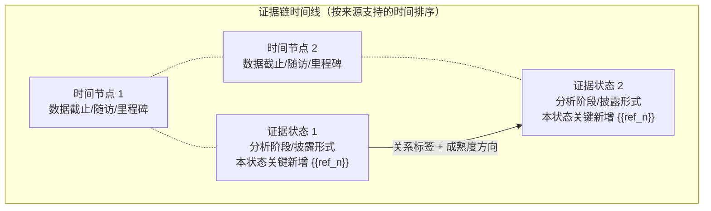
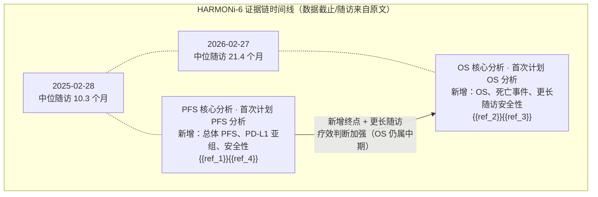

# 证据链时间线图（Mermaid Timeline Diagram）

## 适用范围

- 仅用于**同一试验的多篇披露**（合并后 ≥2 个真正不同的证据状态）的输入。
- 不用于跨试验或混合输入：不同试验没有共享时间线，不生成该图。
- 交付方式：在正文"证据链总览与时间线"一节中，紧邻时间线表格上方，输出一个普通 Mermaid 代码块（` ```mermaid ` 代码围栏）。Tool Smith 的 Markdown 渲染器原生渲染 Mermaid，不经过 `read_me`、`show_widget` 或 workspace 可视化文件协议，也不依赖"内联可视化"能力。除 Mermaid 代码块外，不要额外输出其他图。

## 图要回答的问题

一张图同时展示四件事：

1. **时间顺序**：证据状态按来源支持的时序从左到右排列。排序优先级为 数据截止 → 明确随访 → 分析里程碑 → 披露日期；绝不使用输入顺序、数据库顺序或运行时间戳。
2. **每个状态新增了什么**：节点标签写明本状态新增的终点、估计、亚组、安全性或方法内容。
3. **相邻状态的关系**：边标签写明"更新 / 新增终点 / 确认 / 补充 / 取代 / 冲突 / 不确定"。
4. **证据链如何成熟**：用链上的成熟度注解说明整体判断是加强、基本不变、受到限定、削弱还是无法确定，并说明由哪些证据状态引起。

## 构建规则

1. **一个节点 = 一个证据状态**，不是一篇披露。合并为同一状态的来源共享一个节点，标记并列写在一起（如 `{{ref_1}}{{ref_4}}`）；披露数量多不代表独立验证。
2. **节点标签结构**（用 `<br/>` 换行，第 2 行起可选）：
   - 第 1 行：证据状态名 + 分析阶段/披露形式（如"PFS 核心分析 · 首次计划 PFS 分析"）；
   - 第 2 行：本状态关键新增内容；
   - 第 3 行：引用标记 `{{ref_n}}`（与时间线表格中的标记一致）。
3. **时间轴行**：在状态节点上方放一行时间节点，每个时间节点对应来源明确报告的数据截止/随访/里程碑（如"2025-02-28 · 中位随访 10.3 个月"）。时间节点与对应状态节点用点线 `-.-` 连接。某状态没有来源支持的时间时，时间节点写"时间未明"，不得猜测或推算日期。
4. **边标签**：相邻证据状态之间用实线箭头 `-->`，边标签用双引号包裹，格式为"关系 + 成熟度方向"，例如 `新增终点 + 更长随访，疗效判断加强（OS 仍属中期）`。只有原文支持才标注关系；无法确定的写"不确定"。
5. **成熟度边界**：只写来源支持的成熟度判断。首次/中期分析必须保留"首次/中期"字样，不得写成最终分析。
6. **标签安全**：所有标签用双引号包裹；数值只使用来源明确给出的数字，每个数值紧跟 `{{ref_n}}`。不得插值、合并、排名或按披露数量制造时间点。
7. **回退规则**：
   - 合并后只有 1 个证据状态（其余都是纯重复），或任意两个状态的先后都无法由来源确定时，**不生成时间轴图**，仅保留时间线表格并明确说明顺序不确定。
   - 时间轴图是描述性示意图，不能替代表格中的精确数值；时间线表格必须始终保留。

## 结构模板

`````markdown

`````

## 示例（HARMONi-6：4 篇披露合并为 2 个证据状态）

来源 `{{ref_1}}` 与 `{{ref_4}}` 共享总体 PFS 数值，合并为同一 PFS 状态；来源 `{{ref_2}}` 与 `{{ref_3}}` 共享 2026-02-27 数据截止的 OS 数值，合并为同一 OS 状态。图中不产生四个独立节点，也不把重复披露解释为独立验证。

`````markdown

`````
